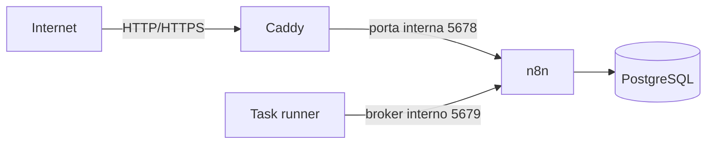

# n8n no Ubuntu 24.04 com Docker, PostgreSQL e HTTPS

Tutorial para iniciantes instalarem uma instância única do n8n em um servidor Ubuntu 24.04, usando:

- Docker Engine e Docker Compose oficiais;
- PostgreSQL separado do n8n;
- task runner externo para os Code nodes;
- Caddy como proxy reverso;
- certificado HTTPS automático;
- subdomínio próprio, por exemplo `n8n.seudominio.com.br`.

> Este guia parte de um servidor novo. Se já existe n8n ou PostgreSQL no servidor, não aplique os comandos cegamente: faça backup e identifique os volumes atuais antes de qualquer mudança.

Versões verificadas em **04/09/2026**: n8n `2.37.9`, Caddy `2.11.4` e PostgreSQL `18`.

## 1. O que será instalado



| Componente | Função | Exposto à internet? |
|---|---|---:|
| Caddy | Recebe HTTP/HTTPS, gera o certificado e encaminha ao n8n | Sim: portas 80 e 443 |
| n8n | Editor, API e execução dos workflows | Não |
| n8n runner | Executa código dos Code nodes fora do processo principal | Não |
| PostgreSQL | Armazena usuários, credenciais, workflows e execuções | Não |

## 2. Pré-requisitos

Você precisa de:

- um servidor 64-bit com Ubuntu Server 24.04 LTS e IP público fixo;
- acesso SSH a um usuário com `sudo`;
- um domínio cujo DNS você possa editar;
- portas TCP 22, 80 e 443 liberadas no firewall do provedor;
- como ponto de partida prático, 2 vCPU, 4 GB de RAM e 20 GB de disco. O consumo real depende dos workflows.

Neste tutorial, substitua:

| Exemplo | Pelo seu valor |
|---|---|
| `IP_DO_SERVIDOR` | IP público da VPS |
| `usuario` | usuário Linux da VPS |
| `n8n.seudominio.com.br` | subdomínio escolhido |
| `voce@seudominio.com.br` | seu e-mail válido |

## 3. Conectar ao servidor

No terminal do seu computador:

```bash
ssh usuario@IP_DO_SERVIDOR
```

Confirme o Ubuntu:

```bash
cat /etc/os-release
uname -m
```

O arquivo `/etc/os-release` deve indicar Ubuntu `24.04`. A arquitetura normalmente será `x86_64` ou `aarch64`.

## 4. Atualizar o Ubuntu e instalar utilitários

```bash
sudo apt update
sudo apt upgrade -y
sudo apt install -y ca-certificates curl git nano openssl dnsutils ufw
sudo timedatectl set-timezone America/Sao_Paulo
```

Confira:

```bash
timedatectl
```

## 5. Instalar o Docker Engine no Ubuntu 24.04

### 5.1 Remover pacotes conflitantes

Em um servidor novo, provavelmente não haverá nada para remover. O comando é preventivo:

```bash
sudo apt remove -y \
  docker.io \
  docker-compose \
  docker-compose-v2 \
  docker-doc \
  docker-buildx \
  podman-docker \
  containerd \
  runc || true
```

Isso não apaga automaticamente imagens e volumes antigos em `/var/lib/docker`. Se este não for um servidor novo, pare e faça um inventário antes de continuar.

### 5.2 Adicionar a chave e o repositório oficiais do Docker

```bash
sudo install -m 0755 -d /etc/apt/keyrings
sudo curl -fsSL https://download.docker.com/linux/ubuntu/gpg \
  -o /etc/apt/keyrings/docker.asc
sudo chmod a+r /etc/apt/keyrings/docker.asc
```

Crie a fonte de pacotes:

```bash
sudo tee /etc/apt/sources.list.d/docker.sources >/dev/null <<EOF
Types: deb
URIs: https://download.docker.com/linux/ubuntu
Suites: $(. /etc/os-release && echo "${UBUNTU_CODENAME:-$VERSION_CODENAME}")
Components: stable
Architectures: $(dpkg --print-architecture)
Signed-By: /etc/apt/keyrings/docker.asc
EOF
```

Atualize a lista de pacotes:

```bash
sudo apt update
```

### 5.3 Instalar Docker e o plugin Docker Compose

```bash
sudo apt install -y \
  docker-ce \
  docker-ce-cli \
  containerd.io \
  docker-buildx-plugin \
  docker-compose-plugin
```

Ative os serviços no boot:

```bash
sudo systemctl enable --now docker
sudo systemctl enable containerd
```

Valide:

```bash
sudo systemctl is-active docker
sudo docker run --rm hello-world
sudo docker version
sudo docker compose version
```

O primeiro comando deve retornar `active`, e o `hello-world` deve terminar com uma mensagem de sucesso.

### 5.4 Usar Docker sem digitar `sudo`

```bash
sudo usermod -aG docker "$USER"
```

Saia da sessão SSH:

```bash
exit
```

Conecte novamente e teste:

```bash
ssh usuario@IP_DO_SERVIDOR
docker run --rm hello-world
```

> Atenção: pertencer ao grupo `docker` equivale, na prática, a ter privilégios de root. Só adicione usuários confiáveis.

## 6. Criar o subdomínio com um registro DNS tipo A

Primeiro descubra o IPv4 público do servidor:

```bash
curl -4 https://icanhazip.com
```

Entre no painel DNS do provedor do domínio e adicione este registro:

| Campo | Valor de exemplo | Explicação |
|---|---|---|
| Tipo | `A` | Aponta um nome para um endereço IPv4 |
| Nome/Host | `n8n` | Gera `n8n.seudominio.com.br` |
| Conteúdo/Valor | `203.0.113.10` | IPv4 público real da VPS |
| TTL | `Auto` ou `300` | Tempo de cache do registro |
| Proxy Cloudflare | `DNS only` inicialmente | Evita que uma configuração incorreta do proxy atrapalhe o primeiro certificado |

Regras importantes:

- não escreva `https://` no campo Nome/Host;
- não coloque porta no registro DNS;
- não crie um registro `AAAA` se o servidor não tiver IPv6 público configurado;
- remova registros `A` ou `AAAA` antigos que apontem o mesmo subdomínio para outro servidor.

Aguarde a propagação e valide usando resolvedores públicos:

```bash
dig +short A n8n.seudominio.com.br @1.1.1.1
dig +short A n8n.seudominio.com.br @8.8.8.8
```

Os dois resultados devem mostrar o IPv4 da VPS. Não suba a aplicação antes disso.

## 7. Configurar os firewalls

No firewall ou Security Group do provedor, libere:

| Porta | Protocolo | Origem recomendada | Uso |
|---:|---|---|---|
| 22 | TCP | somente seu IP, se possível | SSH |
| 80 | TCP | qualquer origem | emissão e renovação HTTPS + redirecionamento |
| 443 | TCP | qualquer origem | HTTPS |
| 443 | UDP | qualquer origem | HTTP/3; opcional |

No Ubuntu, configure o UFW nesta ordem para não bloquear seu próprio SSH:

```bash
sudo ufw allow OpenSSH
sudo ufw allow 80/tcp
sudo ufw allow 443/tcp
sudo ufw allow 443/udp
sudo ufw enable
sudo ufw status verbose
```

Não libere as portas `5432`, `5678` ou `5679`. Elas devem existir somente dentro da rede Docker.

> Docker pode contornar algumas regras do UFW ao publicar portas. Por isso, o `docker-compose.yml` deste guia publica somente 80 e 443 no host.

## 8. Criar a pasta do projeto

```bash
mkdir -p "$HOME/n8n-server/caddy"
cd "$HOME/n8n-server"
pwd
```

O resultado deverá terminar em `/n8n-server`.

Se você clonou este repositório, entre na pasta clonada e pule a criação manual dos arquivos. Ainda será obrigatório criar o `.env` real.

## 9. Criar o `.env.example`

O arquivo `.env.example` pode ir para o GitHub porque contém apenas placeholders. Abra-o:

```bash
nano .env.example
```

Cole o conteúdo do arquivo [`.env.example`](.env.example) deste repositório. No Nano:

1. pressione `Ctrl+O` para salvar;
2. pressione `Enter` para confirmar o nome;
3. pressione `Ctrl+X` para sair.

Agora crie a cópia privada:

```bash
cp .env.example .env
chmod 600 .env
```

Gere quatro segredos diferentes:

```bash
printf 'POSTGRES_PASSWORD=%s\n' "$(openssl rand -hex 32)"
printf 'POSTGRES_NON_ROOT_PASSWORD=%s\n' "$(openssl rand -hex 32)"
printf 'N8N_ENCRYPTION_KEY=%s\n' "$(openssl rand -hex 32)"
printf 'RUNNERS_AUTH_TOKEN=%s\n' "$(openssl rand -hex 32)"
```

Copie cada resultado, abra o arquivo privado e substitua os placeholders:

```bash
nano .env
```

Também troque:

```dotenv
N8N_DOMAIN=n8n.seudominio.com.br
LETSENCRYPT_EMAIL=voce@seudominio.com.br
```

Não use aspas nem espaços ao redor do sinal `=`. O domínio deve ficar sem `https://` e sem barra final.

> Guarde uma cópia segura do `.env`, especialmente de `N8N_ENCRYPTION_KEY`. Sem essa chave, um banco restaurado pode conter credenciais que o n8n não consegue mais descriptografar.

## 10. Criar o script de inicialização do PostgreSQL

```bash
nano init-data.sh
```

Cole o conteúdo de [`init-data.sh`](init-data.sh), salve e torne-o executável:

```bash
chmod 755 init-data.sh
bash -n init-data.sh
```

O script cria `n8n_app`, um usuário sem privilégios de superusuário. Ele roda somente quando o volume do PostgreSQL está vazio, na primeira inicialização.

## 11. Criar o Caddyfile

```bash
nano caddy/Caddyfile
```

Cole:

```caddyfile
{
	email {$LETSENCRYPT_EMAIL}
}

{$N8N_DOMAIN} {
	encode zstd gzip
	reverse_proxy n8n:5678
}
```

O que cada linha faz:

| Linha/bloco | Função |
|---|---|
| `email {$LETSENCRYPT_EMAIL}` | Usa o e-mail definido no `.env` para a conta ACME do certificado |
| `{$N8N_DOMAIN}` | Define qual domínio o Caddy atenderá |
| `encode zstd gzip` | Comprime respostas compatíveis |
| `reverse_proxy n8n:5678` | Envia as requisições ao serviço n8n pela rede interna Docker |

O Caddy solicitará e renovará o certificado automaticamente. Não é necessário instalar Certbot.

## 12. Criar o `docker-compose.yml`

```bash
nano docker-compose.yml
```

Cole o conteúdo completo de [`docker-compose.yml`](docker-compose.yml) deste repositório e salve.

### Explicação linha a linha, agrupada por função

| Linha ou bloco | O que faz |
|---|---|
| `services:` | Inicia a lista de containers da aplicação |
| `postgres:` | Serviço do banco de dados |
| `image: postgres:${POSTGRES_VERSION}` | Baixa a versão do PostgreSQL definida no `.env` |
| `restart: unless-stopped` | Reinicia após falha ou reboot, exceto se você o parou manualmente |
| `environment:` | Injeta banco, usuários e senhas no container |
| `PGDATA: /var/lib/postgresql/data` | Mantém um caminho estável para os dados no PostgreSQL 18 |
| `postgres_data:/var/lib/postgresql/data` | Persiste o banco fora do ciclo de vida do container |
| `init-data.sh:...:ro` | Executa a criação do usuário `n8n_app` apenas no primeiro boot; `ro` significa somente leitura |
| `healthcheck:` do PostgreSQL | Só considera o banco pronto quando `pg_isready` responde |
| `n8n:` | Serviço principal do n8n |
| `docker.n8n.io/n8nio/n8n:${N8N_VERSION}` | Imagem oficial do n8n, com versão controlada pelo `.env` |
| `DB_POSTGRESDB_*` | Faz o n8n usar PostgreSQL em vez de SQLite |
| `N8N_HOST`, `N8N_PROTOCOL` e `N8N_PORT` | Informam ao n8n sua URL pública e sua porta interna |
| `N8N_EDITOR_BASE_URL` | Define a URL pública do editor |
| `N8N_WEBHOOK_URL` | Define a base pública usada na geração de URLs de webhook |
| `N8N_PROXY_HOPS: 1` | Diz que existe um proxy, o Caddy, antes do n8n |
| `N8N_ENCRYPTION_KEY` | Criptografa credenciais persistidas pelo n8n |
| `GENERIC_TIMEZONE` e `TZ` | Configuram o fuso usado por agendamentos e pelo container |
| `EXECUTIONS_DATA_PRUNE` | Ativa a limpeza automática de execuções antigas |
| `N8N_RUNNERS_MODE: external` | Faz Code nodes usarem o task runner separado |
| `expose:` | Documenta portas disponíveis apenas na rede Docker; não as publica na internet |
| `n8n_data:/home/node/.n8n` | Persiste configurações e arquivos internos do n8n |
| `depends_on` + `service_healthy` | Aguarda o serviço dependente ficar saudável antes de iniciar |
| `n8n-runner:` | Serviço isolado que executa código dos workflows |
| `N8N_RUNNERS_AUTH_TOKEN` | Autentica a comunicação privada entre runner e n8n |
| `caddy:` | Proxy reverso e servidor HTTPS |
| `80:80` e `443:443` | Únicas portas TCP publicadas no host |
| `443:443/udp` | Habilita HTTP/3 quando suportado |
| `./caddy:/etc/caddy:ro` | Monta a pasta do Caddyfile como somente leitura |
| `caddy_data:/data` | Persiste certificados e chaves TLS; não apague sem necessidade |
| `networks:` | Cria a rede privada usada pelos quatro serviços |
| `volumes:` | Declara os volumes persistentes gerenciados pelo Docker |
| `logging` | Limita cada log JSON a três arquivos de 10 MB, evitando crescimento infinito |

Dois detalhes de segurança são intencionais:

1. não existe `ports: "5678:5678"` no n8n;
2. não existe `ports: "5432:5432"` no PostgreSQL.

## 13. Criar o `.gitignore`

```bash
nano .gitignore
```

Cole o conteúdo de [`.gitignore`](.gitignore). A regra mais importante é `.env`, que impede o Git de versionar os segredos reais.

Valide:

```bash
git init
git check-ignore -v .env
```

O comando deve mostrar que `.env` foi ignorado. Se não mostrar nada, não publique o repositório ainda.

## 14. Validar todos os arquivos antes de iniciar

Confirme a estrutura:

```bash
find . -maxdepth 2 -type f -not -path './.git/*' -print | sort
```

Se você clonou este repositório, o esperado é:

```text
./.env
./.env.example
./.gitignore
./README.md
./caddy/Caddyfile
./docker-compose.yml
./init-data.sh
```

Em uma instalação criada manualmente, `README.md` pode não existir no servidor; ele não é necessário para executar o n8n.

Verifique se ainda há placeholders nos valores do arquivo privado:

```bash
grep -En '^[A-Z0-9_]+=.*(TROQUE_|seudominio\.com\.br|voce@)' .env
```

O resultado deve estar vazio.

Valide o shell e o Compose:

```bash
bash -n init-data.sh
docker compose config --quiet
```

Se `docker compose config --quiet` não imprimir erro, o YAML e as variáveis obrigatórias foram processados corretamente.

> Não compartilhe a saída de `docker compose config`: ela pode expandir e exibir seus segredos.

## 15. Baixar as imagens Docker

Veja quais imagens serão usadas:

```bash
docker compose config --images
```

Baixe todas:

```bash
docker compose pull
```

Confira:

```bash
docker image ls
```

O `pull` apenas baixa as imagens. Ele não inicia os containers e não apaga volumes.

Para baixar somente a imagem do n8n manualmente, o equivalente é:

```bash
docker pull docker.n8n.io/n8nio/n8n:2.37.9
```

Prefira `docker compose pull`, pois ele usa exatamente as versões do seu `.env`.

## 16. Colocar o n8n no ar

Inicie em segundo plano:

```bash
docker compose up -d
```

Veja o estado:

```bash
docker compose ps
```

Na primeira execução, PostgreSQL e n8n podem levar alguns minutos. Acompanhe:

```bash
docker compose logs -f --tail=100
```

Pressione `Ctrl+C` para sair dos logs. Isso não para os containers.

Valide individualmente:

```bash
docker compose logs --tail=100 postgres
docker compose logs --tail=100 n8n
docker compose logs --tail=100 n8n-runner
docker compose logs --tail=100 caddy
```

Teste a URL:

```bash
curl -I "https://$(grep '^N8N_DOMAIN=' .env | cut -d= -f2-)"
```

Depois abra no navegador:

```text
https://n8n.seudominio.com.br
```

Na primeira tela, crie a conta proprietária do n8n. Use senha forte e e-mail válido.

## 17. Verificações finais

```bash
docker compose ps
docker compose exec n8n n8n --version
docker compose exec postgres pg_isready -U n8n_admin -d n8n
```

Checklist:

- [ ] todos os containers estão `running` ou `healthy`;
- [ ] o navegador mostra HTTPS sem alerta de certificado;
- [ ] o editor do n8n abre pelo subdomínio;
- [ ] o n8n mostra a versão esperada;
- [ ] um workflow simples com Manual Trigger executa;
- [ ] um Code node simples executa pelo task runner;
- [ ] a porta 5678 não abre diretamente por `http://IP_DO_SERVIDOR:5678`;
- [ ] a porta 5432 não está publicada.

Confira as portas realmente publicadas:

```bash
docker compose ps --format 'table {{.Service}}\t{{.Status}}\t{{.Ports}}'
```

Somente o Caddy deve mostrar portas públicas.

## 18. Comandos operacionais

| Ação | Comando |
|---|---|
| Ver containers | `docker compose ps` |
| Ver todos os logs | `docker compose logs -f --tail=100` |
| Ver logs do n8n | `docker compose logs -f --tail=100 n8n` |
| Reiniciar o n8n | `docker compose restart n8n n8n-runner` |
| Parar sem apagar dados | `docker compose stop` |
| Iniciar novamente | `docker compose start` |
| Recriar containers mantendo volumes | `docker compose up -d` |
| Ver uso de recursos | `docker stats` |

> Nunca execute `docker compose down -v` sem um backup validado. A opção `-v` apaga os volumes do banco, do n8n e dos certificados.

## 19. Fazer backup antes de atualizar

Crie a pasta local, carregue as variáveis e gere um dump compactado:

```bash
mkdir -p backups
set -a
source .env
set +a

BACKUP_FILE="backups/n8n-postgres-$(date +%F-%H%M%S).sql.gz"
docker compose exec -T postgres \
  pg_dump -U "$POSTGRES_USER" -d "$POSTGRES_DB" \
  | gzip > "$BACKUP_FILE"

test -s "$BACKUP_FILE"
gzip -t "$BACKUP_FILE"
ls -lh "$BACKUP_FILE"
```

Também copie o `.env` para um cofre de segredos ou armazenamento criptografado. O dump sem a `N8N_ENCRYPTION_KEY` não basta para recuperar credenciais salvas.

## 20. Atualizar o n8n com controle

Não use atualização automática cega em produção. Primeiro:

1. faça backup;
2. consulte a versão estável e as breaking changes;
3. altere apenas `N8N_VERSION` no `.env`;
4. baixe e recrie os serviços;
5. revise logs e execute um workflow de teste.

Comandos:

```bash
nano .env
docker compose config --quiet
docker compose pull n8n n8n-runner
docker compose up -d n8n n8n-runner
docker compose ps
docker compose logs --tail=200 n8n n8n-runner
```

Mantenha `n8n` e `n8n-runner` exatamente na mesma versão.

Atualizações maiores do PostgreSQL exigem migração própria. Nunca troque simplesmente `POSTGRES_VERSION=18` por `19` esperando que o volume antigo seja convertido automaticamente.

## 21. Publicar estes arquivos no GitHub sem vazar segredos

Arquivos que podem ser públicos:

```text
.env.example
.gitignore
README.md
caddy/Caddyfile
docker-compose.yml
init-data.sh
```

O arquivo `.env` real nunca deve aparecer no commit.

```bash
git add README.md docker-compose.yml .env.example .gitignore init-data.sh caddy/Caddyfile
git status
```

Antes do commit, confirme que `.env` não está na lista. Depois:

```bash
git commit -m "docs: adiciona instalação segura do n8n no Ubuntu 24.04"
git branch -M main
git remote add origin https://github.com/SEU_USUARIO/SEU_REPOSITORIO.git
git push -u origin main
```

Se um segredo real já foi publicado, apagar o arquivo no commit seguinte não remove o segredo do histórico. Considere-o comprometido, remova-o do histórico e rotacione-o.

## 22. Solução de problemas

| Sintoma | Diagnóstico | Correção mais provável |
|---|---|---|
| `permission denied` ao usar Docker | usuário ainda não recebeu o novo grupo | saia do SSH, entre novamente e rode `groups` |
| domínio não abre | DNS ainda não aponta para a VPS | compare `dig +short A ...` com o IP público |
| Caddy não consegue emitir certificado | portas 80/443 bloqueadas, DNS errado ou proxy Cloudflare interferindo | libere portas, corrija o A e use `DNS only` durante o primeiro teste |
| erro `502 Bad Gateway` | Caddy está no ar, mas n8n não está saudável | rode `docker compose ps` e veja `docker compose logs n8n` |
| PostgreSQL rejeita senha depois de editar `.env` | variáveis de inicialização não alteram um banco já criado | restaure a senha original; não apague o volume para “tentar de novo” se houver dados |
| Code node não executa | runner parado ou token divergente | confira logs de `n8n` e `n8n-runner`; ambos devem usar o mesmo token e versão |
| webhook mostra URL errada | domínio/URL de webhook incorretos | corrija `N8N_DOMAIN` e mantenha `N8N_WEBHOOK_URL=https://.../` |
| porta 80 ou 443 já está em uso | Apache, Nginx ou outro proxy já escuta no host | identifique com `sudo ss -tulpn | grep -E ':80|:443'` antes de decidir o que parar |
| containers reiniciam sem parar | erro de configuração ou banco | rode `docker compose logs --tail=200` e corrija o primeiro erro real |

## 23. Fontes oficiais

- [Docker Engine no Ubuntu](https://docs.docker.com/engine/install/ubuntu/)
- [Pós-instalação do Docker no Linux](https://docs.docker.com/engine/install/linux-postinstall/)
- [Instalação do n8n com Docker](https://docs.n8n.io/deploy/host-n8n/install-options/install-with-docker/)
- [n8n com Docker Compose](https://docs.n8n.io/deploy/host-n8n/install-options/use-a-cloud-provider/use-docker-compose/)
- [Template oficial n8n + PostgreSQL](https://github.com/n8n-io/n8n-hosting/tree/main/docker-compose/withPostgres)
- [Task runners do n8n](https://docs.n8n.io/deploy/host-n8n/configure-n8n/set-up-task-runners/)
- [Webhook atrás de proxy reverso](https://docs.n8n.io/deploy/host-n8n/configure-n8n/basic-configuration/configuration-examples/configure-webhook-urls-with-reverse-proxy/)
- [Versões estáveis do n8n](https://docs.n8n.io/changelog/release-notes-2.x/)
- [Imagem Docker oficial do Caddy](https://hub.docker.com/_/caddy)
- [Imagem Docker oficial do PostgreSQL](https://hub.docker.com/_/postgres)

## Licença e responsabilidade

Este repositório documenta uma implantação self-hosted. Verifique os termos de licença do n8n e as necessidades de segurança, backup, disponibilidade e proteção de dados do seu ambiente antes de usá-lo em produção.
